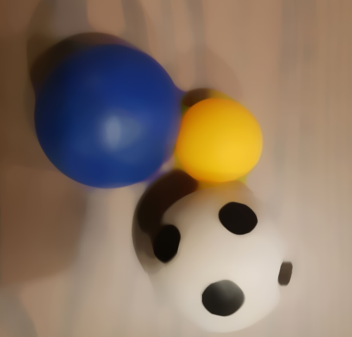

# :warning:  :traffic_light:  :red_car:  === OpenCV - 1 - Rueppellii ===  :red_car:  :traffic_light:  :warning:
> made by Gergo Barta, Gabor Fodor and Fruzsina Vegh

## THE PROJECT
We are working on a program, which can detect shapes and text on pictures, later on video records.

We can already:
 - [x] detect circles on pictures
 - [x] find the middle of them and give back their coordinates
 - [x] calculate their area's
 - [x] use blur function to clean the images (gaussian, median)
 - [x] manupulate with Thres Binary and Thres Binary INV functions
 - [x] save the circles given data in SQLite database
 - [x] justify our work with a lot testcases
 - [ ] at the moment we are working algorithms which we use later in the phase

We use the following technologies:
* __C++14__
* __SQLite3__
* __OpenCV library__
* __Google Test__

## Table of contents
- [THE PROJECT](#the-project)
- [THE PROJECT ITSELF](#the-project-itself)
- [INSTALLATION AND SETUP](#installation-and-setup)

## THE PROJECT ITSELF
 - [Functions we used](docs/functions.md)

 - Pictures
    - detected circles with coordinates and area :

    
    - bluring :

    
    - thresholding :
    
    

## INSTALLATION AND SETUP
 Things you will need:

 - [Visual Studio 2017](https://visualstudio.microsoft.com/downloads/)
 - [CMake](https://github.com/Kitware/CMake/releases/download/v3.14.0-rc1/cmake-3.14.0-rc1-win64-x64.msi)
 - [VCPKG](https://github.com/Microsoft/vcpkg)
 - [OpenCV 4.0.1](https://drive.google.com/open?id=11OIT6GlLsg0z8G8tLzs674nv5BZdKgfq)
 
 - Intall Visual Studio 2017 and the Microsoft Visual c++ toolset with the installer.
 - Install CMake and add it to your PATH environment variable.
 - Start the InstallOCV.sh, it will automatically download the latest version of OpenCV with the extra modules and builds the binaries for you.
 - Create the OPENCV_DIR environment variable and set it to the vc15 folder. (%the folder where installOCV.sh is located%\install\x64\vc15)
 - In Visual Studio, on the property pages of your project set the following properties: C++ -> General -> Additional include libraries -> "$(OPENCV_DIR)\..\..\include", Linker -> General -> Additional library directories -> "$(OPENCV_DIR)\lib", Linker -> Input -> Additional Dependencies ->  "opencv_world401.lib;opencv_world401.lib;ws2_32.lib;"
 - Clone the VCPKG repo and follow the instructions to install it. ('bootstrap-vcpkg.bat' and 'vcpkg integrate install')
 - Install Sqlite3, gtest and Tesseract with the following command with VCPKG: 'vcpkg install sqlite3:x64-windows', 'vcpkg install tesseract:x64-windows' and 'vcpkg install gtest:x64-windows'
 - Known issue: on some machines, Visual Studio can't find the opencv-world401.dll, in that case, copy the file from the OpenCV install folder to the folder of the built executable
 
 Enjoy!
 
 
 
 
 

