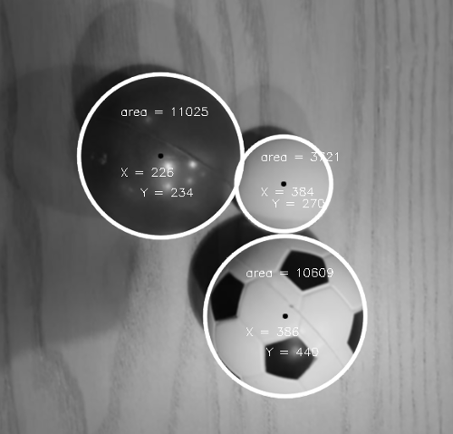

# :warning:  :traffic_light:  :red_car:  === OpenCV - 1 - Rueppellii ===  :red_car:  :traffic_light:  :warning:
> made by Gergo Barta, Gabor Fodor and Fruzsina Vegh

## THE PROJECT
We are working on a program, which can detect shapes and text on pictures, later on video records.

We can already:
 - [x] detect circles on pictures
 - [x] find the middle of them and give back their coordinates
 - [x] calculate their area's
 - [x] use blur function to clean the images (gaussian, median)
 - [x] manupulate with Thres Binary and Thres Binary INV functions
 - [x] save the circles given data in SQLite database
 - [x] justify our work with a lot testcases
 - [ ] at the moment we are working algorithms which we use later in the phase

We use the following technologies:
* __C++14__
* __SQLite3__
* __OpenCV library__
* __Google Test__

## Table of contents
- [THE PROJECT](#the-project)
- [THE PROJECT ITSELF](#the-project-itself)
- [INSTALLATION AND SETUP](#installation-and-setup)

## THE PROJECT ITSELF
 - Pictures

 - [Functions we used](docs/functions.md)

## INSTALLATION AND SETUP
 Things you will need:

 - [Jetbrains CLion](https://www.jetbrains.com/clion/)
 - [MinGW-w64](https://drive.google.com/open?id=1tNNNxxlnYyeeiGAozp307DbwI1kel2AQ)
 - [CMake](https://github.com/Kitware/CMake/releases/download/v3.14.0-rc1/cmake-3.14.0-rc1-win64-x64.msi)
 - [OpenCV 4.0.1](https://github.com/opencv/opencv/archive/4.0.1.zip)
 - [SQLite3](https://drive.google.com/open?id=1fUCQl_v66Zl4Wb51pFHGSVmeZyfMp83z)
 - [Google Test](https://github.com/green-fox-academy/teaching-materials/blob/master/workshop/testing/env-setup/cpp/resource/googletest.zip)

Building OpenCV with CMake:
 - Download the Mingw-w64 linked above. It may or may not work with other version.
 - Extract the file and set the ./x86_64-8.1.0-posix-sjlj-rt_v6-rev0/mingw64/bin directory in the
 PATH environment variable. (You might need to restart your machine)
 - Extract the OpenCV archive
 - Open CMake
 - Tick grouped and advanced for clarity afterwards
 - Press the browse source button and locate the extracted OpenCV folder
 - Press the browse build button and set the location you want to build to
 - Press configure and if asked, use native compiler,
 - After half an eternity, you're greeted by a bunch of red text
 - Now is the important part: In Build, look for built type and set it to 'Release'. In Enable, untick precompiled headers.
 In With, untick MSMF and IPP.
 - Click configure again
 - Now, everything should be white. You can click on generte now.
 - Open CMD and navigate to the build directory you generated
 - type 'mingw32-make' and press enter
 - Go and take a shower, cook dinner, go for a run, it will take a while
 - No, it's not done yet
 - Not yet
 - ...
 - Okay, let's pretend it's done(probably it's not)
 - In CMD, type 'mingw32-make install'
 - Now, in the OpenCV build folder, locate ./install/x64/mingw/lib and set it as an environment variable called OPENCV_DIR
 - Now, for SQLite3, extract the downloaded file
 - We're going to build this with CMake too, in CMake, click browse source and locate the SQLite3 folder
 - Browse build can be whatever
 - Configure, configure, generate
 - Navigate to the SQLite3 build folder with CMD (you might need to run it as administrator)
 - type mingw32-make and when it finished, mingw32-make install(if it fails, you need to run CMD as administrator)
 - SQLite3 install in Program Files (x86) by default
 - Locate the ./sqlite3/lib/cmake folder and set it as an environment variable called SQLITE3_DIR
 - Locate the ./sqlite3/include folder and set it as an environment variable called SQlite3_inc
 - Extract the contents of the linked googletest archive
 - Locate the googletest folder and set it as an environment variable called PATH_TO_GOOGLETEST
 - In CLion, go to Settings -> Build, Execution, Deployment -> Toolchains
 - At the environment field, locate the mingw-w64 you built OpenCV and SQLite3 with
 - Fork and clone the repository
 - Open the project folder in CLion with File -> Import Project and then click on Open existing CMake project
 - CLion should generate a folder in the projet root, called cmake-build-debug
 - In your OpenCV install directory, locate ./install/x64/mingw/bin
 - Copy all the DLL files to the cmake-build-debug folder and the gtest folder found in cmake-build-debug
 - Enjoy...
